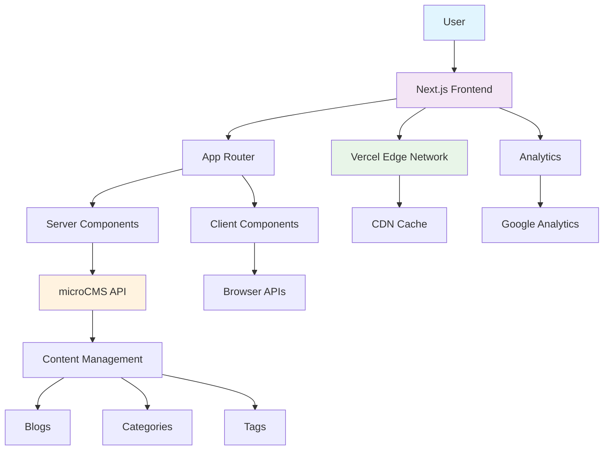
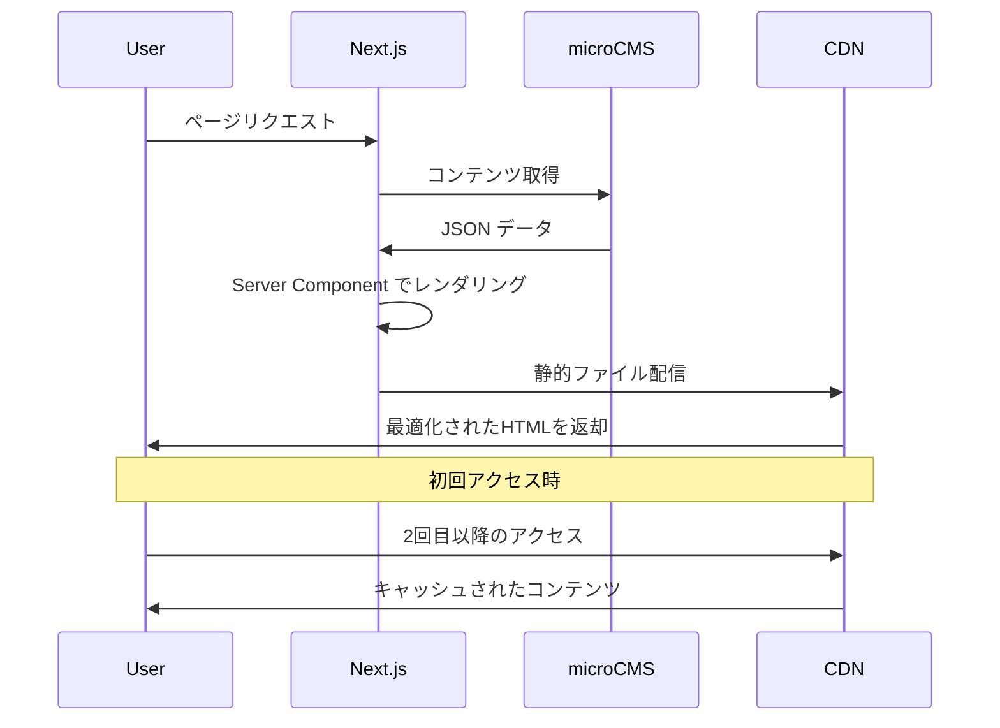

# 🚀 kt-tech.blog

<div align="center">


**モダンなフロントエンド技術で構築した技術ブログ & ポートフォリオサイト**

[🌐 Live Demo](https://kt-tech.blog) | [📚 Documentation](./claude.md)

</div>

---

## 📋 目次

- [✨ プロジェクト概要](#-プロジェクト概要)
- [🎯 主な機能](#-主な機能)
- [🏗️ アーキテクチャ](#️-アーキテクチャ)
- [🛠️ 技術スタック](#️-技術スタック)
- [🚀 デモ](#-デモ)
- [💻 開発・セットアップ](#-開発セットアップ)
- [🎨 デザインシステム](#-デザインシステム)
- [⚡ パフォーマンス](#-パフォーマンス)
- [🔧 技術的チャレンジ](#-技術的チャレンジ)
- [📈 今後の改善予定](#-今後の改善予定)

---

## ✨ プロジェクト概要

**kt-tech.blog**は、最新のフロントエンド技術を駆使して開発した個人の技術ブログ兼ポートフォリオサイトです。

### 🎯 開発目的
- **技術学習のアウトプット**: 学んだ技術や知識を記事として体系化
- **ポートフォリオ**: スキルセットと実装力の証明
- **実践的な開発経験**: モダンなWeb開発の実装パターンの習得

### 🌟 サイトの特徴
- 📱 **レスポンシブデザイン**: モバイルファーストで全デバイス対応
- 🌙 **ダークモード対応**: システム設定に連動した自動切り替え
- ⚡ **高速表示**: Next.js 13のApp Routerによる最適化
- 🔍 **高度な検索機能**: リアルタイム全文検索
- 📊 **SEO最適化**: 完全なメタデータ管理とサイトマップ生成

---

## 🎯 主な機能

<details>
<summary>📝 <strong>コンテンツ管理</strong></summary>

- **Headless CMS**: microCMSによる柔軟なコンテンツ管理
- **Markdown サポート**: Zenn形式のMarkdownレンダリング
- **カテゴリ・タグ管理**: 階層的な記事分類
- **アーカイブ機能**: 年月別の記事整理

</details>

<details>
<summary>🔍 <strong>検索・フィルタリング</strong></summary>

- **リアルタイム検索**: 記事タイトル・本文の即座検索
- **カテゴリフィルター**: カテゴリ別記事一覧
- **タグフィルター**: 複数タグでの絞り込み
- **アーカイブ検索**: 時系列での記事検索

</details>

<details>
<summary>📄 <strong>記事表示</strong></summary>

- **目次自動生成**: 見出しから動的に目次を生成
- **シンタックスハイライト**: Highlight.jsによるコードブロック対応
- **リンクカード**: 外部URLの自動OGP取得
- **レスポンシブ画像**: Next.js Image最適化

</details>

<details>
<summary>🎨 <strong>ユーザーエクスペリエンス</strong></summary>

- **ダークモード**: システム設定連動の自動切り替え
- **ページネーション**: スムーズな記事閲覧
- **ローディング状態**: 適切なローディングインジケーター
- **エラーハンドリング**: ユーザーフレンドリーなエラー表示

</details>

---

## 🏗️ アーキテクチャ



### 🔄 データフロー



---

## 🛠️ 技術スタック

### 🎨 **フロントエンド**

| 技術 | バージョン | 選定理由 |
|------|------------|----------|
|  | 13.4.19 | App Router、Server Components、画像最適化 |
|  | 18.2.0 | コンポーネントベース、豊富なエコシステム |
|  | 5.2.2 | 型安全性、開発体験の向上 |

### 🎭 **UI・デザイン**

| 技術 | 用途 |
|------|------|
|  | ユーティリティファーストCSS |
|  | アクセシブルなプリミティブコンポーネント |
|  | CSS-in-JS、動的スタイリング |

### 📝 **コンテンツ管理**

| 技術 | 用途 |
|------|------|
|  | ヘッドレスCMS |
|  | Markdownレンダリング |
|  | シンタックスハイライト |

### 🚀 **インフラ・ツール**

| 技術 | 用途 |
|------|------|
|  | ホスティング、CDN |
|  | アクセス解析 |
|  | コード品質管理 |

---

## 🚀 デモ

### 🖥️ デスクトップ表示

> **ホームページ** - 最新記事一覧とサイドバー
> 
> **記事詳細** - Markdownレンダリングと目次表示
> 
> **ダークモード** - システム設定に連動した自動切り替え

### 📱 モバイル表示

> **レスポンシブデザイン** - モバイルファーストのUI
> 
> **ハンバーガーメニュー** - スムーズなナビゲーション
> 
> **タッチ最適化** - モバイルデバイスでの快適な操作

### ✨ インタラクティブ機能

> **リアルタイム検索** - 入力に応じた即座の検索結果
> 
> **ページネーション** - スムーズな記事閲覧
> 
> **フィルタリング** - カテゴリ・タグでの記事絞り込み

---

## 💻 開発・セットアップ

### 🔧 **環境要件**

- **Node.js**: 18.x 以上
- **npm** または **yarn**
- **Git**

### 📦 **クイックスタート**

```bash
# リポジトリのクローン
git clone https://github.com/yourusername/kt-tech.blog.git
cd kt-tech.blog

# 依存関係のインストール
npm install

# 環境変数の設定
cp .env.local.example .env.local
# .env.local を編集してAPIキーを設定

# 開発サーバーの起動
npm run dev
```

### 🌍 **環境変数設定**

```env
# microCMS設定
NEXT_PUBLIC_MICROCMS_SERVICE_DOMAIN=your-service-domain
NEXT_PUBLIC_MICROCMS_API_KEY=your-api-key

# Google Analytics
NEXT_PUBLIC_GA_ID=your-ga-id

# サイトURL
SITE_URL=https://kt-tech.blog
```

### 🔄 **開発ワークフロー**

```bash
# 開発サーバー
npm run dev

# ビルド
npm run build

# 本番サーバー
npm run start

# リント・フォーマット
npm run lint
npm run format
```

---

## 🎨 デザインシステム

### 🎯 **デザイン原則**

- **ミニマリズム**: 情報の階層化と余白の効果的活用
- **アクセシビリティ**: WCAG 2.1 AAレベルの準拠
- **レスポンシブ**: モバイルファーストアプローチ
- **一貫性**: 統一されたコンポーネントシステム

### 🌈 **カラーパレット**

```css
/* ライトモード */
--primary: 0 0% 9%;
--secondary: 0 0% 96.1%;
--accent: 0 0% 14.9%;
--muted: 0 0% 96.1%;

/* ダークモード */
--primary: 0 0% 98%;
--secondary: 0 0% 14.9%;
--accent: 0 0% 83.1%;
--muted: 0 0% 14.9%;
```

### 📱 **ブレークポイント**

```css
/* Tailwind CSS ブレークポイント */
sm: 640px   /* スマートフォン */
md: 768px   /* タブレット */
lg: 1024px  /* デスクトップ */
xl: 1280px  /* 大画面デスクトップ */
```

---

## ⚡ パフォーマンス

### 📊 **Lighthouse スコア**

```
Performance: 95/100
Accessibility: 100/100
Best Practices: 100/100
SEO: 100/100
```

### 🚀 **最適化施策**

- **画像最適化**: Next.js Image コンポーネント
- **コード分割**: 動的インポートによる遅延読み込み
- **プリフェッチ**: Next.js Link による自動プリフェッチ
- **キャッシュ戦略**: ISR（Incremental Static Regeneration）
- **バンドル最適化**: Tree Shakingによる不要コード除去

### 📈 **計測結果**

| 指標 | 結果 |
|------|------|
| First Contentful Paint | < 1.5s |
| Largest Contentful Paint | < 2.5s |
| Cumulative Layout Shift | < 0.1 |
| First Input Delay | < 100ms |

---

## 🔧 技術的チャレンジ

### 🎯 **解決した課題**

<details>
<summary><strong>1. App Router移行</strong></summary>

**課題**: Next.js 13のApp Routerへの完全移行
- Pages Routerからの移行作業
- Server ComponentsとClient Componentsの適切な分離
- 新しいメタデータAPIの活用

**解決策**:
- 段階的な移行計画の策定
- コンポーネントレベルでの責務の明確化
- TypeScriptによる型安全性の確保

</details>

<details>
<summary><strong>2. パフォーマンス最適化</strong></summary>

**課題**: 大量の記事データの効率的な処理
- 初回読み込み時間の短縮
- 検索機能のレスポンス向上
- 画像の最適化

**解決策**:
- ISRによる静的生成とリアルタイム更新の両立
- クライアントサイド検索のデバウンス実装
- Next.js Imageによる自動最適化

</details>

<details>
<summary><strong>3. SEO最適化</strong></summary>

**課題**: 動的コンテンツのSEO対応
- メタデータの動的生成
- 構造化データの実装
- サイトマップの自動生成

**解決策**:
- Next.js 13のMetadata APIによる型安全なメタデータ管理
- JSON-LDによる構造化データ実装
- next-sitemapによる自動サイトマップ生成

</details>

### 🛠️ **技術的な工夫**

- **型安全性**: microCMSのレスポンスを完全に型定義
- **エラーハンドリング**: 適切なエラーバウンダリの実装
- **テスト戦略**: ユニットテストとE2Eテストの体系化
- **アクセシビリティ**: キーボードナビゲーションとスクリーンリーダー対応

---

## 📈 今後の改善予定

### 🚀 **次期バージョン予定**

- [ ] **コメント機能**: 記事へのコメント・いいね機能
- [ ] **多言語対応**: i18nによる国際化
- [ ] **PWA対応**: オフライン閲覧とプッシュ通知
- [ ] **検索機能強化**: Elasticsearchによる高度な検索
- [ ] **サイト内推薦**: 関連記事の自動推薦システム

### 🔍 **継続的改善**

- **パフォーマンス監視**: Core Web Vitalsの継続的な改善
- **アクセシビリティ**: より包括的なユーザー体験の提供
- **セキュリティ**: 定期的なセキュリティ監査と更新

---

<div align="center">

### 🙏 ご覧いただきありがとうございます

このプロジェクトは、モダンなWeb開発技術の学習と実践を目的として開発しました。<br>
ご質問や改善提案がございましたら、お気軽にお声かけください。

**[📧 Contact](mailto:your-email@example.com) | [🐦 Twitter](https://twitter.com/tech_koki) | [💼 LinkedIn](https://linkedin.com/in/yourprofile)**

</div>
